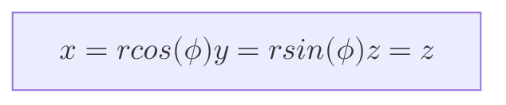

# Modelling 3d displays - a journey

Are you interested in making displays of interesting shapes? Flat screens not just cutting it
for you?
Join me on a journey of 3d displays and how to actually get accurate pictures on them, as
I jump headfirst into some of the pitfalls so you don't have to.

When first embarking on the 3d displays journey, I threw myself into the task by starting with a
shape not traditionally associated with squares, a sphere, or at least a portion of a sphere.
After quickly (not quick enough) realising the torment I had put myself through, I took a step back and decided to start with
shapes that are more amicable to being made up of squares, which is where this blog post starts.

We will cover two displays in this first blog post, a curved wall and an open cube.
The second blog post will cover the spheres, so if you would like to jump ahead and not heed my warning then do so here *insert link*

The outcome of these blogs can be found with this [command line tool][trm].
Feel free to have a play around with it and let me know what you think.

## Object 1 - The curved wall

I started with the curved wall as this had the simplest UV map, which was the same as a flat wall made up of square tiles.
If you are not familiar with what a UV map is, then check out this [handy link.][uvex]
An example of a curved wall uv map looks like so.

!["a curved wall uv map"][cvbi]

See how simple this uv map looks an note how it takes up the whole image.
Not every uv map will have these features as we'll see later.

To start generating the wall we need to first work out how our tiles will fit
together, this means calculating the positions of the tiles.
For generating a curved wall we will be working in [cylindrical coordinates][cc],
as this allows us to handle the angular increments of the tiles along the wall.
Furthermore as the tiles only change angle in one direction, there is no change in the width of the
wall as the height changes, this is something we have to consider for more complicated objects.

The first step was converting the tile width distance to an angle, so that each angle increment was a single unit of tile width.
This can be done with the chordal length formula.

!["The chordal length formula"][cl]

This takes a distance between two points on a circle and gives the angle between them from the origin.
The angle increment of each tile is uniform, so we could now calculate how many tiles wide the wall is.
The vertical tile count is more trivial with it just being (the height of the wall)/(the height of the tiles).
As there are thankfully no angles to consider when moving vertically.

The plan was then to iterate the tiles along the circumference, one tile angle at a time.
We could then generate the 3d coordinates four corner vertexes of the tile and the corresponding 2d UV map.
The vertexes corners corresponded to:

- v1 (r, angle, z)
- v2 (r, angle + angle increment, z)
- v3 (r, angle + angle increment, z + tile height)
- v4 (r, angle, z + tile height)

The radius is constant throughout.

These cylindrical coordinates were then converted to cartesian ones with following formulas.
(Apologies if the formatting is not correct on gitlab or github is not correct, they
might be missing the KaTeX backend)

The uv map was created by incrementing the tile heights and widths, treating the angle
increase as an increase in u and the z increase as an increase in v.
It was treated a completely flat object and only 2d coordinates were considered.

After doing this and getting weird triangle shaped tiles I realised that the order of vertices were important!
The shape you get is based on the order you join the dots, so if it isn't sequential then things will get funky fast.
The order I settled on for this and all other shapes in the blogs, was
bottom left, bottom right, top right and then top left in an anti clockwise order. For v1,v2,v3 and v4 respectively
(The order of the vertexes earlier has been amended to reflect this learning.)

Then when this was done the uv map first generated an inverse image, I had got the horizontal coordinates flipped :\( .
I had to flip them to calibrate the uv map, to match the viewing experience as if viewed from the origin.
Then finally the curve looked like how we wanted, although it is a little stretched in this image, as the uv map
image is square, but the physical shape of the wall is rectangular.

!["a complete curve"][cubi]

Now we have a simple obj , complete with uv map (and tsig) we could move onto the next object.

## Object 2 The cube

The next object to be tackled was an open cube, this is also simpler than a sphere,
by virtue of there being no smooth surfaces or complex shapes to accommodate.

The cube also had the added bonus of being in cartesian coordinates,
so no nasty angles were required for calculating vertex positions.
To make our lives simpler, each cube face calculation was designed to only move in 2d,  where the third plane
was constant.
E.g. the back panel of the cube is constant in the direction y, so when moving tiles along,
only the x (for width) and z (for height) coordinates were changed.

This tile position algorithm was repeated for the top and bottom of the cube (constant z plane)
and side panels (constant x plane)
following the anticlockwise motion for assigning vertexes
described earlier.

So now we have a object we need to do the uv map, which required some creative intent, as the cube can be unfolded in a myriad of ways.
Unlike a cylindrical wall, which had a pretty cut and dry approach to UV maps.
We went for the design below that centred around the back wall,
as this would seem to be the focus in a led room with an open side.

!["a cube uv map"][cui]

However this was not the end for the cube UV map, as each mirroring face had one wall facing the wrong direction.
The horizontal coordinates then had to be flipped again for the right wall and the vertical coordinates of the
bottom panel. This was sometimes figured out through trial and error.

Finally we get a cube which can display images as intended, check it
out below.

!["a complete cube"][cvi]

Thank you for reading this blog about shapes and uv maps, I
hope you found it helpful. Check out part 2 here where we
delve into creating sphere objs.

[trm]: https://gitlab.com/mm-eng/tsig
[uvex]: https://conceptartempire.com/uv-mapping-unwrapping/
[cc]: https://en.wikipedia.org/wiki/Cylindrical_coordinate_system

[cui]: ./cubeUV.jpg
[cvbi]: ./curveUV.jpg
[cubi]: ./curveview.jpg
[cvi]: ./cubeview.jpg

[cl]: ./chordLength.svg