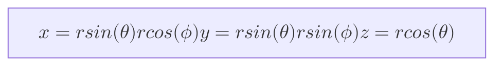

# Spheres squares and sadness

Continuing our journey into 3d displays we now tackle a spherecap,
made entirely from square display tiles.
We will building from the lessons learnt in blog1 *link*,
if you missed it feel free to check it out.

## The sphere cap

A sphere cap is the cap section of a sphere, and we chose this because
it matches the type of displays currently out there. e.g. A planetarium.
Complete spheres are not a common display, if any exist.

A new shape meant another new coordinate system, this time we'll be using
[spherical coordinates][sc]. This means we now have two angles to contend
with, as we move our square tiles around to construct the sphere cap.

We will go back to using the chordal length formula again,
this time with a little tweak to accommodate having two angles.
To calculate the angle for change in inclination we can use the same
chordal length formula as last time.

!["The chordal length formula"][cl]

Now for finding the increment in the azimuth, because the cross sectional circle
of the sphere changes size with the inclination angle, we need to update the
formula to reflect this.
This is done by dividing the chordal length by the sin of the inclination angle,
the formula for finding the azimuth is now this.

!["The chordal length formula for a sphere"][cls]

First we find the inclination increment, as this is constant throughout the sphere.
Then as we step to each new inclination we calculate the azimuth step.
At first the same azimuth increment was used for the top and bottom of the tile coordinates,
this was my first mistake as the tiles overlapped each other in the corners.
Why? The increments varied slightly due to the inclination as mentioned earlier, so the
angle change was actually moving the tile along further than intended.
So we had to go back and calculate the angle change at the top and the bottom of the
tiles, after doing this we ended up with wonky parallelogram tiles.
This was because start points for each tile at top and the bottom increased unevenly as the
angles were not equal, so the start points got further apart the larger the azimuth was.

We had to fix this by starting the bottom azimuth from where the top azimuth stopped.
This resulted in a slight gap that increased in size as you went down the tile,
but this is as close we'll get with a curved object made of flat tiles.

Once we figured out how to get the angle steps right the
vertexes corners corresponded to:

- v1 (r, theta, azimuth)
- v2 (r, theta, azimuth + azimuth bottom increment)
- v3 (r, theta + theta increment, azimuth + azimuth top increment)
- v4 (r,  theta + theta increment, azimuth)

The radius is constant throughout. We started at the inclination of pi/2, and an azimuth of 0,
then calculated the sphere in 4 quadrants from this starting point (top left, top right, bottom left, bottom right)
, to ensure the display was symmetrical.

These cylindrical coordinates were then converted to cartesian ones with following formulas.
(Apologies if the formatting is not correct on gitlab or github is not correct, they
might be missing the KaTeX backend)

Now we have the shape, we need the UV maps, how on earth are we going to get
this non square on a square shape.
The first step was just a uv map the resembles the rough idea. Which was a pallelogram
like so, where the pixels slide along each line.

!["The first attempt at a spherical uv map"][suv1]

This looks close enough, and when viewed on the obj it looks correct, but how to get this
on square tile? After some fruitless endeavours that involved going back to
cylindrical coordinates, just trying squares again (just in case they worked) and
seriously considering adding angles where they shouldn't be, I stumbled onto a solution.
The square should be broken into rows, with one row for each single pixel shift in the x direction.
This meant the square tiles were formed of rectangles in the obj, as each rectangle needed
to be a separate tile to work with the UV map, which now looks like so.

!["A uv map made of rectangles"][suv2]

This is where I really learned the importance of a uv map checker, such as this one
on the wikipedia article on uv mapping.
It helped get everything lined up and told me when things where upside down,
as the rows were inverted among other mistakes.
I went back and checked all the results from blog 1 and
had to make fixes to some inverted uv maps, that were not caught by gradients of the initial
ebu3373 pattern I used as a test. (These fixes are already included in the blog)

The end result looks like this, you can see the gaps in the screen where the tiles do not line up.

!["A uv map made of rectangles"][sv1]

Its not perfect, but thats the nature of making a sphere out of tiles,
to get more accurate pictures, its best to use smaller tiles and a larger radius.
Please check out the resulting go code from these blogs *here*,
let me know if you have any feedback.

[sc]: https://en.wikipedia.org/wiki/Spherical_coordinate_system

[cl]: ./chordLength.svg
[cls]: ./chordLengthSphere.svg

[suv1]: ./spherefirst.jpg
[suv2]: ./sphereUV.jpg
[sv1]: ./sphereView.jpg